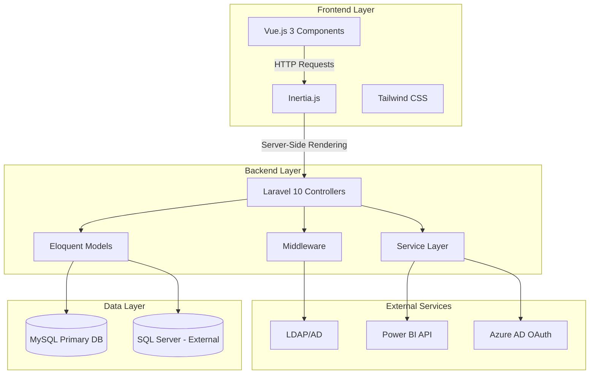
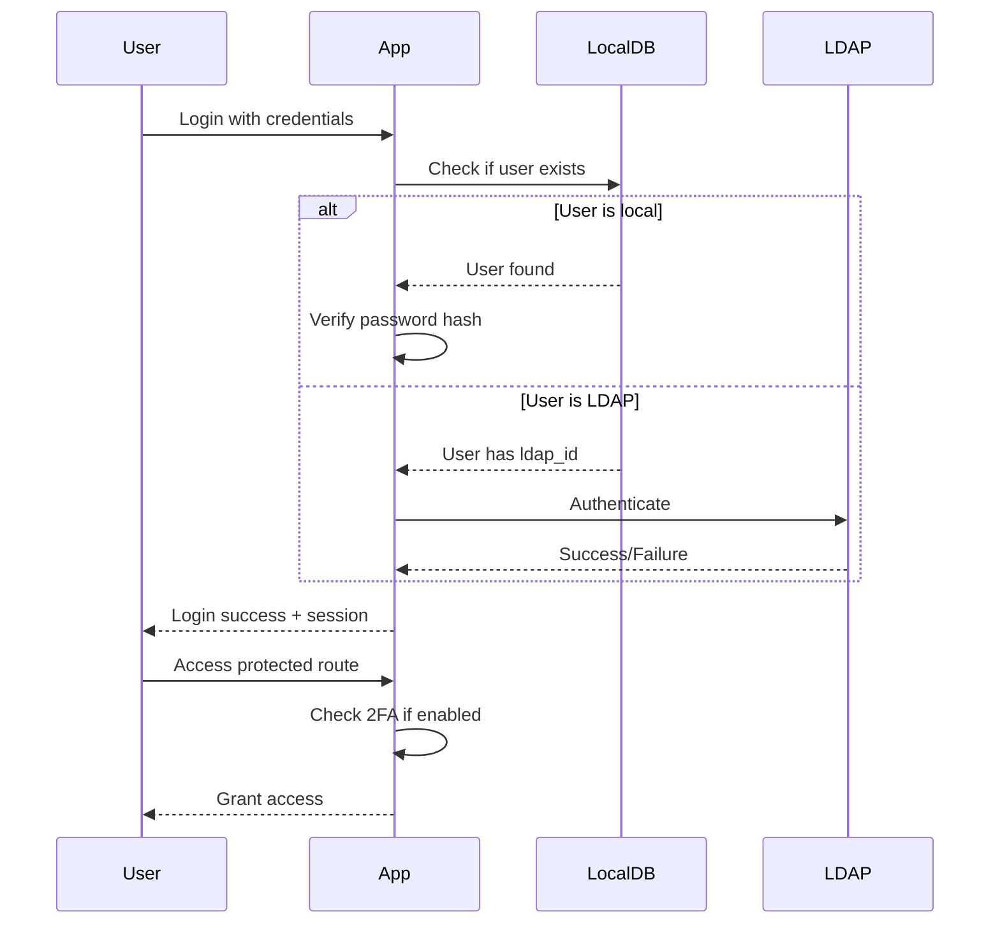
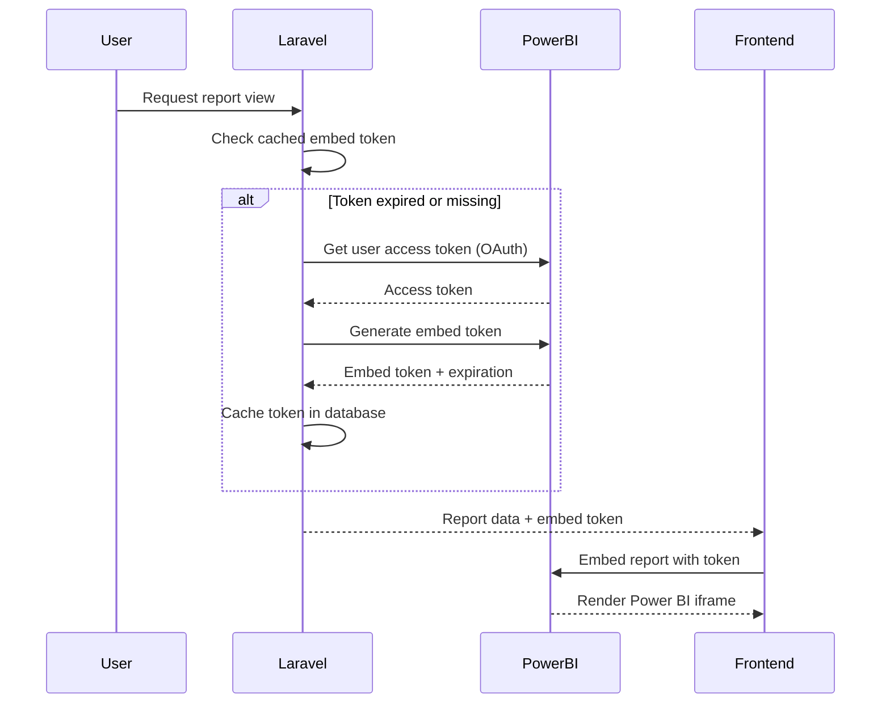

## Overview

GB App is built on a modern full-stack architecture combining Laravel 10 for the backend API with Vue.js 3 for the frontend, connected through Inertia.js for seamless server-side rendering and client-side interactivity.

## Technology Stack

### Backend

<CardGroup cols={2}>
  <Card title="Laravel 10" icon="php">
    PHP 8.1+ framework with Jetstream authentication and Sanctum API tokens
  </Card>
  <Card title="MySQL/SQL Server" icon="database">
    Primary database with support for both MySQL and Microsoft SQL Server connections
  </Card>
  <Card title="Guzzle HTTP" icon="globe">
    HTTP client for Power BI API integration and external service communication
  </Card>
  <Card title="Spatie Permissions" icon="shield">
    Role-based access control with granular permission management
  </Card>
</CardGroup>

**Key Backend Dependencies** (from `composer.json`):

```json composer.json
{
  "require": {
    "php": "^8.1",
    "laravel/framework": "^10.10",
    "laravel/jetstream": "^3.2",
    "laravel/sanctum": "^3.2",
    "inertiajs/inertia-laravel": "^0.6.8",
    "spatie/laravel-permission": "^5.10",
    "directorytree/ldaprecord-laravel": "^3.4",
    "guzzlehttp/guzzle": "^7.2",
    "tightenco/ziggy": "^1.0"
  }
}
```

### Frontend

<CardGroup cols={2}>
  <Card title="Vue.js 3" icon="vuejs">
    Composition API with reactive components and modern JavaScript
  </Card>
  <Card title="Inertia.js" icon="layer-group">
    Server-side routing with client-side page rendering - no separate API needed
  </Card>
  <Card title="Tailwind CSS" icon="palette">
    Utility-first CSS framework with custom configuration
  </Card>
  <Card title="Vite" icon="bolt">
    Fast build tool with hot module replacement
  </Card>
</CardGroup>

**Key Frontend Dependencies** (from `package.json`):

```json package.json
{
  "dependencies": {
    "vue": "^3.2.31",
    "@inertiajs/vue3": "^1.0.0",
    "tailwindcss": "^3.1.0",
    "powerbi-client": "^2.22.3",
    "powerbi-client-vue-js": "^1.0.3",
    "@vuelidate/core": "^2.0.3",
    "vue-i18n": "^9.2.2",
    "vue-sweetalert2": "^5.0.5",
    "@fortawesome/vue-fontawesome": "^3.0.3"
  }
}
```

## Application Architecture



## Directory Structure

### Backend Structure

```
app/
├── Actions/              # Jetstream actions (authentication, user management)
│   └── Fortify/          # Authentication logic
├── Console/              # Artisan commands
│   └── Commands/         # Custom commands (LDAP sync, route closure)
├── Http/
│   ├── Controllers/      # Request handlers
│   ├── Middleware/       # Request filtering
│   └── Requests/         # Form validation
├── Models/               # Eloquent ORM models
├── Traits/               # Reusable code (PowerBITrait)
└── Providers/            # Service providers

config/                   # Configuration files
├── database.php          # Database connections
├── ldap.php             # LDAP configuration
└── power-bi.php         # Power BI API settings

database/
├── migrations/           # Schema definitions
├── factories/            # Test data generators
└── seeders/             # Database seeding

routes/
├── web.php              # Web routes (main application)
├── api.php              # API routes
└── channels.php         # Broadcast channels
```

### Frontend Structure

```
resources/
├── js/
│   ├── app.js                    # Application entry point
│   ├── Components/               # Reusable Vue components
│   │   ├── Datatables/          # DataTable implementations
│   │   └── RutasTecnicas/       # Technical routes components
│   ├── CustomComponents/         # Custom form inputs
│   │   ├── LitePicker/          # Date picker
│   │   └── TomSelect/           # Select dropdown
│   ├── Layouts/                  # Page layouts
│   │   ├── AppLayout.vue        # Authenticated layout
│   │   └── GuestLayout.vue      # Guest layout
│   └── Pages/                    # Inertia pages
│       ├── Auth/                # Authentication pages
│       ├── Dashboard.vue        # Main dashboard
│       ├── Design/              # Design request module
│       ├── ListaPrecios/        # Price list module
│       ├── Profile/             # User profile
│       └── Report/              # Report management
├── css/
│   └── app.css                  # Tailwind imports
└── views/
    └── app.blade.php            # Root HTML template
```

## Request Flow

### Inertia.js Request Cycle

<Steps>
  <Step title="User interaction">
    User clicks a link or submits a form in a Vue component
    
    ```javascript
    // In Vue component
    import { router } from '@inertiajs/vue3'
    
    router.visit('/reports')
    ```
  </Step>

  <Step title="Inertia request">
    Inertia.js intercepts the request and sends an XHR request with special headers
    
    ```http
    GET /reports HTTP/1.1
    X-Inertia: true
    X-Inertia-Version: <asset-version>
    ```
  </Step>

  <Step title="Laravel controller">
    Controller processes the request and returns an Inertia response
    
    ```php
    // app/Http/Controllers/ReportController.php
    public function index()
    {
        $reports = auth()->user()->reports;
        
        return Inertia::render('Report/Index', [
            'reports' => $reports,
        ]);
    }
    ```
  </Step>

  <Step title="JSON response">
    Laravel returns a JSON payload with component name and props
    
    ```json
    {
      "component": "Report/Index",
      "props": {
        "reports": [...]
      },
      "url": "/reports",
      "version": "<asset-version>"
    }
    ```
  </Step>

  <Step title="Client-side render">
    Inertia.js swaps the Vue component and updates the page without a full reload
  </Step>
</Steps>

## Authentication Flow

### Hybrid Authentication System

GB App supports both local database authentication and LDAP integration:



Implementation in `app/Actions/Fortify/AuthenticateUserHybrid.php:38-67`

## Deployment Architecture

### Docker Container Setup

The application runs in a multi-container Docker environment:

```yaml docker-compose.yml
services:
  app:
    build: .
    ports:
      - "80:80"
    volumes:
      - .:/var/www/html
    environment:
      - DB_CONNECTION=mysql
      - DB_HOST=db
  
  db:
    image: mysql:8.0
    environment:
      - MYSQL_ROOT_PASSWORD=password
      - MYSQL_DATABASE=GBapp
```

<Info>
  The application container includes PHP 8.2, Nginx, Supervisor, and Node.js for a complete runtime environment.
</Info>

### Container Components

- **PHP-FPM**: Processes PHP requests
- **Nginx**: Web server and reverse proxy
- **Supervisor**: Process manager for queue workers
- **Node.js**: Frontend asset building

## Power BI Integration

### Token Management Architecture



Implementation in `app/Traits/PowerBITrait.php`

## Database Connections

### Multi-Database Strategy

<CardGroup cols={2}>
  <Card title="Primary MySQL" icon="database">
    User accounts, reports, roles, permissions, design requests
  </Card>
  <Card title="External SQL Server" icon="server">
    Read-only access to business data (price lists, customer info, technical routes)
  </Card>
</CardGroup>

**Configuration** in `config/database.php`:

```php
'connections' => [
    'mysql' => [
        'driver' => 'mysql',
        'host' => env('DB_HOST', '127.0.0.1'),
        'database' => env('DB_DATABASE', 'GBapp'),
        // ...
    ],
    'sqlsrv_external' => [
        'driver' => 'sqlsrv',
        'host' => env('EXTERNAL_DB_HOST'),
        'database' => env('EXTERNAL_DB_DATABASE'),
        // Read-only connection
    ],
],
```

Models specify their connection:

```php
class ListaPrecio extends Model
{
    protected $connection = 'sqlsrv_external';
    protected $table = 'vw_lista_precios';
}
```

## Performance Considerations

### Caching Strategy

- **Power BI tokens**: Cached in database with expiration tracking
- **Permission checks**: Spatie package handles role/permission caching
- **Configuration**: Laravel config cache for production
- **Routes**: Route caching enabled in production

### Optimization Commands

```bash
# Production optimization
php artisan optimize
php artisan config:cache
php artisan route:cache
php artisan view:cache

# Clear all caches
php artisan optimize:clear
```

## Security Architecture

### Defense Layers

1. **Authentication**: Jetstream with 2FA support
2. **Authorization**: Spatie Permission package with middleware
3. **CSRF Protection**: Laravel's built-in CSRF tokens
4. **XSS Prevention**: Blade templating auto-escaping
5. **SQL Injection**: Eloquent ORM parameter binding
6. **Rate Limiting**: Configured in `app/Http/Kernel.php`

### Middleware Stack

Every authenticated request passes through:

```php
Route::middleware([
    'auth:sanctum',
    config('jetstream.auth_session'),
    'verified'
])->group(function () {
    // Protected routes
});
```

## Next Steps

<CardGroup cols={2}>
  <Card title="Database Schema" href="/development/database-schema">
    Explore the complete database structure and relationships
  </Card>
  <Card title="Frontend Structure" href="/development/frontend-structure">
    Learn about Vue.js components and Inertia.js pages
  </Card>
  <Card title="Development Setup" href="/development/setup">
    Set up your local development environment
  </Card>
  <Card title="Coding Standards" href="/development/coding-standards">
    Follow the project's code conventions
  </Card>
</CardGroup>