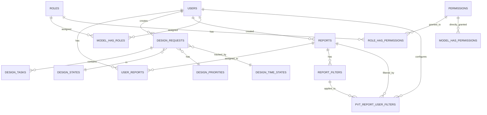

## Overview

GB App uses a relational database schema designed for multi-tenancy, role-based access control, and Power BI report management. The schema is managed through Laravel migrations located in `database/migrations/`.

## Core Tables

### Users Table

**Migration**: `2014_10_12_000000_create_users_table.php`

Stores user accounts with support for both local and LDAP authentication:

```php
Schema::create('users', function (Blueprint $table) {
    $table->id();
    $table->string('name');
    $table->string('email')->unique();
    $table->timestamp('email_verified_at')->nullable();
    $table->string('password')->nullable();  // Nullable for LDAP users
    $table->rememberToken();
    $table->foreignId('current_team_id')->nullable();
    $table->string('profile_photo_path', 2048)->nullable();
    $table->timestamps();
});
```

**Extended Fields** (from `2026_01_14_095321_add_ldap_fields_to_users_table.php`):

```php
$table->string('ldap_id')->nullable()->unique();  // LDAP unique identifier
$table->string('ldap_domain')->nullable();        // LDAP domain
$table->string('cedula')->nullable();             // National ID
$table->string('codigo_vendedor')->nullable();    // Sales code
$table->foreignId('advisor_id')->nullable();      // Technical advisor link
```

**Relationships**:
- Has many `Report` through `user_reports` pivot
- Belongs to `User` as advisor (for technical user hierarchy)
- Has many `DesignRequest`
- Created many `Report` records

### Two-Factor Authentication

**Migration**: `2014_10_12_200000_add_two_factor_columns_to_users_table.php`

```php
$table->text('two_factor_secret')->nullable();
$table->text('two_factor_recovery_codes')->nullable();
$table->timestamp('two_factor_confirmed_at')->nullable();
```

Stores encrypted 2FA secrets and recovery codes for each user.

## Power BI Report Management

### Reports Table

**Migration**: `2023_06_30_143012_create_reports_table.php`

```php
Schema::create('reports', function (Blueprint $table) {
    $table->id();
    $table->string('name');                    // Report display name
    $table->string('group_id');               // Power BI workspace ID
    $table->string('report_id');              // Power BI report ID
    $table->string('dataset_id');             // Power BI dataset ID
    $table->string('access_level');           // View, Edit, Create
    $table->text('token')->nullable();        // Cached embed token
    $table->timestamp('expiration_date')->nullable();  // Token expiration
    $table->foreignId('user_id')              // Creator
        ->constrained()->onDelete('cascade');
    $table->timestamps();
});
```

**Extended Fields** (from `2023_11_20_071601_add_fields1_to_reports_table.php`):

```php
$table->string('icon')->nullable();           // FontAwesome icon
$table->string('description')->nullable();    // Report description
```

### User-Report Assignment

**Migration**: `2023_07_05_144516_create_user_reports_table.php`

Pivot table linking users to reports:

```php
Schema::create('user_reports', function (Blueprint $table) {
    $table->id();
    $table->foreignId('user_id')
        ->constrained()->onDelete('cascade');
    $table->foreignId('report_id')
        ->constrained()->onDelete('cascade');
    $table->boolean('is_default')->default(false);  // Default report
    $table->timestamps();
});
```

### Report Filters

**Migration**: `2023_08_16_092408_create_report_filters_table.php`

```php
Schema::create('report_filters', function (Blueprint $table) {
    $table->id();
    $table->foreignId('report_id')
        ->constrained()->onDelete('cascade');
    $table->string('name');                   // Filter display name
    $table->string('table');                  // Power BI table name
    $table->string('column');                 // Power BI column name
    $table->string('operator');               // In, Equals, Contains, etc.
    $table->text('values')->nullable();       // JSON array of values
    $table->timestamps();
});
```

**User-Filter Assignment**:

**Migration**: `2023_08_16_093151_create_pvt_report_user_filters_table.php`

```php
Schema::create('pvt_report_user_filters', function (Blueprint $table) {
    $table->id();
    $table->foreignId('user_id')
        ->constrained()->onDelete('cascade');
    $table->foreignId('report_id')
        ->constrained()->onDelete('cascade');
    $table->foreignId('report_filter_id')
        ->constrained()->onDelete('cascade');
    $table->text('values');                   // User-specific filter values
    $table->timestamps();
});
```

## Role-Based Access Control

### Permission Tables

**Migration**: `2023_06_30_140153_create_permission_tables.php`

Spatie Laravel Permission creates 5 tables:

```php
// Permissions
Schema::create('permissions', function (Blueprint $table) {
    $table->id();
    $table->string('name');         // e.g., 'report.create'
    $table->string('guard_name');   // 'web' or 'api'
    $table->timestamps();
});

// Roles
Schema::create('roles', function (Blueprint $table) {
    $table->id();
    $table->string('name');         // e.g., 'admin'
    $table->string('guard_name');
    $table->timestamps();
});

// Role-Permission pivot
Schema::create('role_has_permissions', function (Blueprint $table) {
    $table->foreignId('permission_id')
        ->constrained()->onDelete('cascade');
    $table->foreignId('role_id')
        ->constrained()->onDelete('cascade');
    $table->primary(['permission_id', 'role_id']);
});

// User-Role pivot
Schema::create('model_has_roles', function (Blueprint $table) {
    $table->foreignId('role_id')
        ->constrained()->onDelete('cascade');
    $table->morphs('model');  // user_id + user_type
    $table->primary(['role_id', 'model_id', 'model_type']);
});

// Direct user-permission assignments
Schema::create('model_has_permissions', function (Blueprint $table) {
    $table->foreignId('permission_id')
        ->constrained()->onDelete('cascade');
    $table->morphs('model');
    $table->primary(['permission_id', 'model_id', 'model_type']);
});
```

## Design Request Module

### Design States

**Migration**: `2023_07_11_122814_create_design_states_table.php`

```php
Schema::create('design_states', function (Blueprint $table) {
    $table->id();
    $table->string('name');        // Pending, In Progress, Completed
    $table->string('color');       // Hex color for UI
    $table->timestamps();
});
```

### Design Priorities

**Migration**: `2023_07_11_122914_create_design_priorities_table.php`

```php
Schema::create('design_priorities', function (Blueprint $table) {
    $table->id();
    $table->string('name');        // Low, Medium, High, Urgent
    $table->string('color');
    $table->timestamps();
});
```

### Design Time States

**Migration**: `2023_07_11_122825_create_design_time_states_table.php`

```php
Schema::create('design_time_states', function (Blueprint $table) {
    $table->id();
    $table->string('name');        // On Time, Delayed
    $table->string('color');
    $table->timestamps();
});
```

### Design Requests

**Migration**: `2023_07_11_123314_create_design_requests_table.php`

```php
Schema::create('design_requests', function (Blueprint $table) {
    $table->id();
    $table->string('title');                      // Request title
    $table->text('description');                  // Detailed description
    $table->foreignId('design_priority_id')
        ->constrained()->onDelete('cascade');
    $table->foreignId('design_state_id')
        ->constrained()->onDelete('cascade');
    $table->foreignId('design_time_state_id')
        ->constrained()->onDelete('cascade');
    $table->foreignId('user_id')                  // Creator
        ->constrained()->onDelete('cascade');
    $table->date('due_date')->nullable();         // Deadline
    $table->timestamps();
});
```

### Design Tasks

**Migration**: `2023_07_11_123802_create_design_tasks_table.php`

```php
Schema::create('design_tasks', function (Blueprint $table) {
    $table->id();
    $table->foreignId('design_request_id')
        ->constrained()->onDelete('cascade');
    $table->string('name');                       // Task name
    $table->text('description')->nullable();      // Task details
    $table->boolean('completed')->default(false); // Completion status
    $table->timestamps();
});
```

## Session Management

**Migration**: `2023_06_30_135731_create_sessions_table.php`

```php
Schema::create('sessions', function (Blueprint $table) {
    $table->string('id')->primary();
    $table->foreignId('user_id')->nullable()->index();
    $table->string('ip_address', 45)->nullable();
    $table->text('user_agent')->nullable();
    $table->longText('payload');
    $table->integer('last_activity')->index();
});
```

Database-backed sessions for scalability and session management features.

## Entity Relationship Diagram



## External Database Views

GB App also queries read-only views in an external SQL Server database:

### Price Lists

```sql
-- vw_lista_precios (external SQL Server view)
CREATE VIEW vw_lista_precios AS
SELECT 
    codigo_producto,
    descripcion,
    precio_base,
    precio_descuento,
    tipo_producto,
    clase_producto,
    grupo_producto,
    inventario_disponible
FROM productos
```

Accessed via:

```php
class ListaPrecio extends Model
{
    protected $connection = 'sqlsrv_external';
    protected $table = 'vw_lista_precios';
    public $timestamps = false;
}
```

### Customer Data

```sql
-- vw_clientes (external SQL Server view)
CREATE VIEW vw_clientes AS
SELECT
    cliente_id,
    razon_social,
    direcciones,
    contactos,
    telefono,
    email
FROM clientes
```

## Migration History

Migrations run in chronological order. Key milestones:

<Steps>
  <Step title="2014: Laravel base tables">
    Users, password resets, two-factor authentication
  </Step>
  
  <Step title="2023 June: Core features">
    Sessions, permissions, reports, user-report assignments
  </Step>
  
  <Step title="2023 July: Design module">
    Design states, priorities, time states, requests, tasks
  </Step>
  
  <Step title="2023 August: Report filters">
    Report filters and user-filter assignments
  </Step>
  
  <Step title="2026 January: LDAP integration">
    LDAP authentication fields, user identifiers
  </Step>
  
  <Step title="2026 February: Technical users">
    Advisor-technician relationships
  </Step>
</Steps>

## Indexes and Performance

### Key Indexes

- `users.email` - Unique index for login lookups
- `users.ldap_id` - Unique index for LDAP sync
- `reports.group_id, reports.report_id` - Composite for Power BI lookups
- `user_reports.user_id, user_reports.report_id` - Composite for assignments
- `sessions.last_activity` - Index for session cleanup

### Foreign Key Constraints

All relationships use cascading deletes to maintain referential integrity:

```php
$table->foreignId('report_id')
    ->constrained()
    ->onDelete('cascade');  // Delete related records automatically
```

## Database Seeding

The default seeder creates:

- Super admin user
- Basic roles (admin, user)
- Core permissions
- Sample design states/priorities

```bash
php artisan migrate --seed
```

<Warning>
  Only run seeders in development or during initial production setup. They may override existing data.
</Warning>

## Next Steps

<CardGroup cols={2}>
  <Card title="Architecture Overview" href="/development/architecture">
    Understand the full system architecture
  </Card>
  <Card title="Frontend Structure" href="/development/frontend-structure">
    Learn about Vue.js components and pages
  </Card>
  <Card title="Development Setup" href="/development/setup">
    Set up your local environment with migrations
  </Card>
  <Card title="API Reference" href="/api/reports/list">
    Explore the REST API endpoints
  </Card>
</CardGroup>