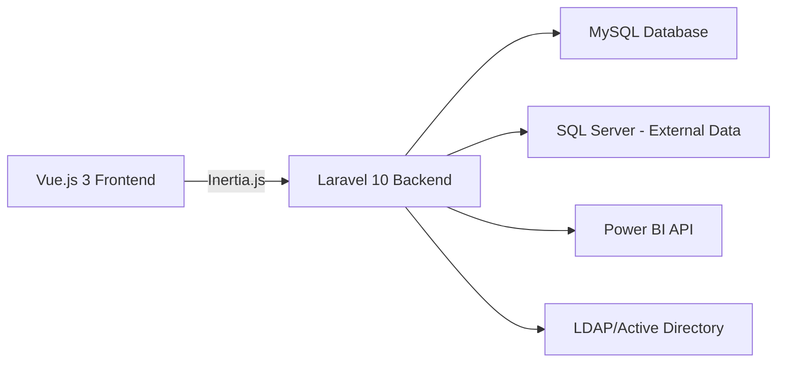

## What is GB App?

GB App is a comprehensive Power BI report management platform designed to streamline how organizations distribute and control access to business intelligence reports. Built with Laravel and Vue.js, it provides enterprise-grade authentication, role-based access control, and seamless Power BI integration.

## Why GB App?

<CardGroup cols={2}>
  <Card title="Centralized Management" icon="building">
    Manage all your Power BI reports in one place with user-friendly dashboards
  </Card>
  <Card title="Enhanced Security" icon="shield">
    Two-factor authentication, LDAP integration, and granular permission control
  </Card>
  <Card title="Seamless Embedding" icon="window">
    Automatically handle Power BI token management and report embedding
  </Card>
  <Card title="Business Workflows" icon="diagram-project">
    Design requests, price lists, and technical route management built-in
  </Card>
</CardGroup>

## Key Features

### Power BI Integration

GB App handles the complexity of Power BI API authentication and token management:

- **Automatic Token Refresh**: Embed tokens are cached and automatically refreshed before expiration
- **Report Importing**: Import reports directly from your Power BI workspaces
- **Filter Management**: Configure and apply filters per user for personalized report views
- **Multi-Workspace Support**: Manage reports across multiple Power BI workspaces

### Role-Based Access Control

Fine-grained permission system using Spatie Laravel Permission:

- **Custom Roles**: Create roles tailored to your organization's structure
- **Permission Scoping**: Control access at the report, module, and action level
- **Super Admin**: Special role with unrestricted access for system administrators
- **Middleware Protection**: Routes automatically enforce permission checks

### Authentication Options

Flexible authentication supporting multiple user directories:

- **Local Authentication**: Standard email/password authentication with bcrypt hashing
- **LDAP Integration**: Seamless Active Directory integration for enterprise environments
- **Two-Factor Authentication**: Optional 2FA with QR code setup and recovery codes
- **Session Management**: View and manage active sessions across devices

### Business Modules

Beyond report management, GB App includes specialized business workflows:

- **Design Requests**: Track design tasks with priorities, states, and deadlines
- **Price Lists**: Search and export product pricing from external databases
- **Technical Routes**: Schedule and manage technical visit routes with client data

## Architecture

GB App is built on a modern, scalable stack:

**Frontend**:
- Vue.js 3 with Composition API
- Inertia.js for server-side rendering
- Tailwind CSS for styling
- Vite for fast builds

**Backend**:
- Laravel 10 with Jetstream
- Spatie Laravel Permission
- Guzzle HTTP for API integration
- Sanctum for API tokens

**Infrastructure**:
- Docker containers
- Nginx web server
- Supervisor for process management
- MySQL for application data
- SQL Server for business data (read-only)

## Use Cases

### Corporate Reporting

Distribute Power BI reports to employees based on their department and role:

- Sales team sees sales dashboards filtered to their region
- Executives access company-wide analytics
- Managers view team performance metrics
- Auditors get read-only access to financial reports

### Multi-Tenant SaaS

Provide Power BI reports to external clients:

- Each client sees only their own data through filters
- Custom branding per client workspace
- Usage tracking and analytics
- Automated report provisioning

### Business Process Automation

Integrate report viewing into existing workflows:

- Embed reports in custom dashboards
- Trigger report refresh based on data updates
- Send scheduled report snapshots
- Integrate with ticketing systems

## Getting Started

<CardGroup cols={2}>
  <Card title="Quick Start" icon="rocket" href="/quickstart">
    Get GB App running in minutes with Docker
  </Card>
  <Card title="Installation Guide" icon="book" href="/installation">
    Detailed setup for production deployment
  </Card>
  <Card title="Configuration" icon="gear" href="/configuration/environment">
    Configure Power BI API, database, and LDAP
  </Card>
  <Card title="API Reference" icon="code" href="/api/authentication/overview">
    Explore the REST API documentation
  </Card>
</CardGroup>

## Who Built This?

GB App was developed to address the challenges of Power BI report distribution in enterprise environments. It combines proven open-source technologies with best practices in authentication, authorization, and API integration.

The platform is actively maintained and includes:

- Regular security updates
- Power BI API compatibility
- Laravel framework updates
- Community contributions

## Next Steps

Ready to dive in? Start with the [Quick Start Guide](/quickstart) to get GB App running on your local machine, or jump to the [Installation Guide](/installation) for production deployment instructions.

For developers looking to contribute or customize, check out the [Development Setup](/development/setup) guide and [Architecture Documentation](/development/architecture).
